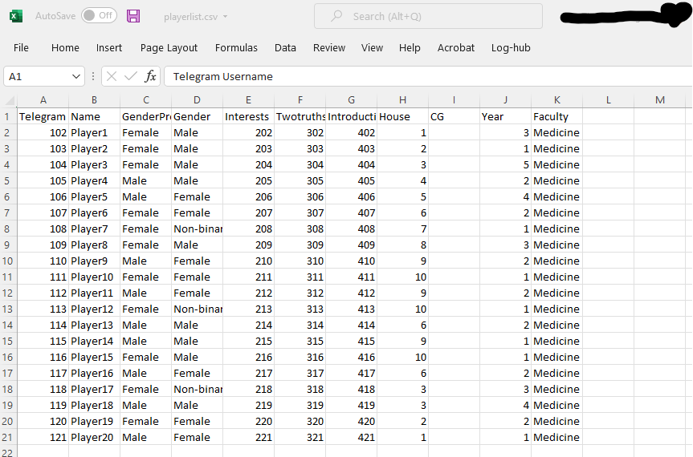
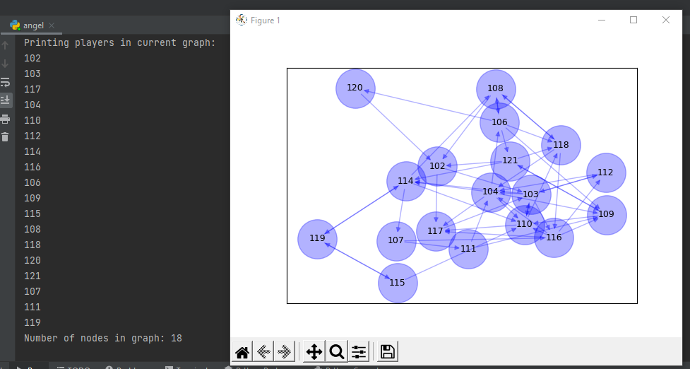
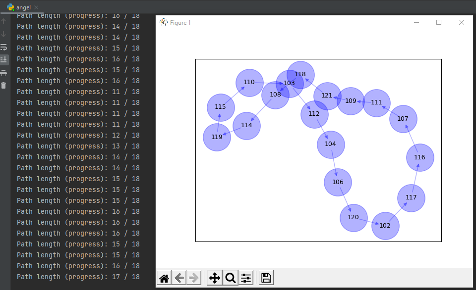
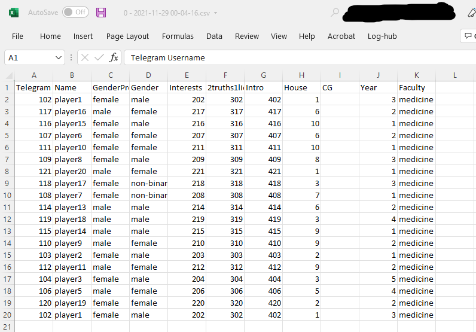

# Angels & Mortals Matching algorithm for NUS Medicine & Nursing (with yeozhenhao's automatic transposer script)
## Transposer script & Matching script functions (in photos)
*I believe that a picture paints a thousand words - yeozhenhao*
####
\
***Start with a playerlist.csv. Presumably the data is collected through a form***
####
\
***angel.py script finds multiple ways to interconnect players based on matching criteria***\
After running **angel.py** in an IDE like *PyCharm*, 
the terminal should print something, and a window will 
pop up once every second. But all you need to do is to 
keep closing the window until one of the windows show 
lots of nodes with arrows interconnecting them. 
This means the Matching script has managed to found multiple
possible ways to match them (after taking into account their
gender preferences, & ensuring the Clinical Group & House numbers
are not the same). For more information on matching criteria,
you may read below.\
You should close this window again, and the next pop-up window should
show you the proper matches.
####
\
***After closing some windows, you should ideally see a pop-up window showing nodes connected altogether in a one-way loop by arrows***\
Again, keep closing the pop-up window until you see that many nodes are
connected to each other by a one-way arrow. This means the script has
successfully managed to find all the nodes (that were shown in the pop-up window)
a Mortal & an Angel.\
You should close this window again, and there will be a couple more pop-up windows which
you should close again but the bot should export out a *"0 - xxxxxxxxx"* .csv file soon. 
####
\
***End of a angel.py script that has successfully matched >80% of players in the input playerlist.csv***\
After no more pop-up windows are shown & angel.py script has terminated, the terminal 
should ideally indicate to you that CSV is printed, and also tell you the list of players (technically a *Python dictionary*) 
that were not matched and thus not in the *"0 - xxxxxxxxx"* .csv output file. You will need to match them manually.
####
*Note: the *"0 - xxxxxxxxx"* .csv output file will not be created if the **angel.py** script is unable to match >80% of players in the input playerlist.csv.*
####
\
***"0 - xxxxxxxxx" .csv output file from a successful matching by angel.py script***\
For each row (player) in the .csv file, the Angel is the player row above, and the Mortal is the player row below.\
Essentially, Angels & Mortals is a game where the matching can form a closed one-way loop.
####
\
***Initial terminal output after running transpose_for_bot.py***\
First, rename the *0 - xxxxxxxxx.csv* into **1.csv**\
Then, simply run *transpose_for_bot.py*.\
The terminal should initially print a *pandas dataframe* of the 1.csv file.
This dataframe will be manipulated to get the final output.

####
\
***2nd terminal output after 1st manipulation of dataframe***\
Column names of Column 2 & 3 are changed to *"Angel"* & *"Mortal"* respectively as printed on the terminal.\
Also, data of Column 1 is copied onto Columns 2 & 3.
####
\
***3rd terminal output after 2nd manipulation of dataframe***\
Data in Column 2 is shifted down by 1 row.\
Data in Column 3 is shifted up by 1 row.\
We will deal with NaN values next.
####
\
***Final terminal output after last manipulation of dataframe***\
NaN value in Column 2 is replaced with the last row data in Column 1.\
NaN value in Column 3 is replaced with the first row data in Column 1.
####
\
***Final Players List.csv after transposing of data with transpose_for_bot.py script***\
This Final Players List.csv can be directly used into [yeozhenhao's Angels & Mortals Dual Bots](https://github.com/yeozhenhao/Angels_Mortals_bot)
to start playing an Angels & Mortals game on Telegram!
####

## Accreditation
Special thanks to **Sriram Sami** for his idea of using Hamilton algorithm with the `networkx` python module.
####
Please check out his website if you want to learn how it works in Angels & Mortals: https://sriramsami.com/archangel/

## What I changed
- changes of player's preferences for NUS Medicine & Nursing faculty (e.g. CG number, House number)
####
- an important one-line replacement of a deprecated `networkx` command in **arrange.py** so the algorithm works with the latest `networkx==2.6.3`.
####
- **NEW .csv output functions:**\
1: Output .csv only prints when matching algorithm successfully matches >80% of players in the inital .csv input file.\
2: Also, log file will record a list of Telegram usernames which failed to get a match and are thus not included in the CSV output. They will need to be matched manually.
####
- **Other minor changes:**\
1: Changed all of the `print` command formatting to the new-style `print (f'.......')` commands to fix issues running on Python==3.9\
2: Now reads .csv files with header columns\
3: Added logging for various functions for easier readability & debugging\
4: New requirements.txt file with the latest versions of required python modules (tested working as of October 2021)

## Overview
The matching for Angels & Mortals can be done with a Hamiltonian-cycle based approach to finding valid angel-mortal chains based on player's preferences.\
`networkx` was used for the Hamilton algorithm.

### TLDR: How matching is done
- ensures have their gender preferences satisfied
- ensures matches are NOT from the same Clinical Group (CG)
- ensures matches are NOT from the same House\
*Note: The % leniency in matching for the aforementioned criteria can be set in **arrange.py***
- only if >80% of the entire player base has a suitable match, then a "Final Players List" .csv output will be generated

## How to use the Matching Algorithm
1. Clone the repo
2. Create a virtual environment so that the required libraries don't pollute your namespace (Optional). Run `virtualenv venv` in the cloned directory.
3. Install requirements with `pip install -r requirements.txt`
4. Put a csv file with headers (see below for the header names; the first row will not be processed) with all details of participants in correct order in a file called `playerlist.csv` in the main folder.
5. Run `python angel.py`
6. Output will be a .csv file with naming format based on time & date at runtime

## Columns required for playerlist.csv
First, playerlist.csv should have a header row with all the column names.

The columns in playerlist.csv should be arranged as such, with 1 being the leftmost column. Important columns for matching: Gender preference, Gender, House number, CG number.

1. Telegram Username
2. Name
3. Gender Preference (for Angel & Mortal)
4. Gender
5. Interests 
6. Two truths one lie
7. Self-introduction (for Mortal only)
8. House Number (in Medicine & Nursing faculty)
9. CG Number (in Medicine & Nursing faculty)
10. Year of Study
11. Faculty

**Output CSV** will have the same columns but no header.\
Players will be arranged such that for each player row in the output .csv file, his/her Angel is in the row above and his/her Mortal is in the row below.

## If you're looking for an Angels & Mortals Telegram Bot
You may check out my other Python repository: [Angel and Mortals Dual Telegram Bots](https://github.com/yeozhenhao/Angels_Mortals_bot)
